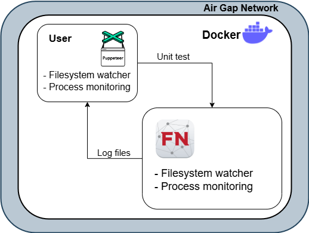

## RepoShield

Reposhield is a Visual Code Extension that protects your web application code from vulnerabilities and supply chain attacks.

It is built as a VS Code Extension to seamlessly analyse your projects when coding, or when being pulled from a repository.

## Features

- Static Application Security Testing (SAST)
    - CodeQL
    - Semgrep
- Custom Dynamic Application Security Testing (DAST)
    - Gemini LLM
    - Nuclei
- Sandboxing
    - FakeNet
    - Puppeteer

Features are ran in a docker, so docker is required to be installed and running on the user's system.

## How it works

All the features are executed in a docker container so that they can be used in a controlled environment.

A 1Gemini API key` has to be configured under the extension in order for the dynamic scan and sandbox to work.

### Static Application Security Testing (SAST)

Static code analysis uses [CodeQL](https://codeql.github.com/) and [Semgrep](https://semgrep.dev/) and returns a `.sarif` log file that points out which part of the code has been detected to be vulnerable. This is used in tandem with the `SARIF Viewer` VS Code Extension to make viewing of vulnerable code easier.

Custom queries can also be created and built upon to scan potential vulnerable code.

### Custom Dynamic Application Security Testing (DAST)

Dynamic Analysis tests against potential vulnerabilities that can be found in the code that static analysis fails to find.

The endpoints of the web application are first extracted using `Gemini LLM`. These endpoints are then used in (Nuclei)[https://github.com/projectdiscovery/nuclei] to fuzz these endpoints and check the response returned by these endpoints. A simple example is to fuzz an endpoint for potential Local File Inclusion (LFI) vulnerabilities.

These findings are then returned to the user so that they can mitigate them.

### Sandboxing

Using Gemini LLM, the command to run the application and the web application's endpoints are returned. These are then used to run the application in a sandbox environment that is created by Docker.

This container has been stripped of the internet access, and `FakeNet` is also used in order to simulate a fake network in order for any malicious code to be executed and spotted by the sandbox.

[Process](https://github.com/DominicBreuker/pspy) and [filesystem](https://github.com/0x413x4/watcher) watchers are also put into place. Logs from these watchers are generate for each run so that any behaviour that is atypical can be easily compared. Atypical behaviour can only be spotted by the user as any new logs created is only compared to the previous timet the run has been ran. In future works, we aim to integrate LLM to spot any malicious logs.

Unit Testing is also done to simulate a normal user behaviour when visiting the website. This is done using `puppeteer`.

#### Sandboxing (Feature Plans)

For future plans, we aim to air gap both unit testing system and the server running system all in a docker container. We also aim to add more analysers for both systems.

## VS Code Extension Development

Refer to the `README` under the `reposhield` folder for more information on how to work on developing the extension.

Ensure that you have docker installed and running on the system.
